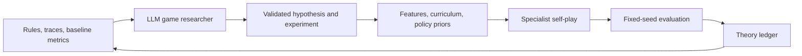

# Hearthstone Research Lab

[简体中文](README.zh-CN.md)

Hearthstone Research Lab, or CardLab, is a runnable research harness for a narrow but
strategically meaningful card-game environment. It combines a specialist policy trained by
self-play with an LLM research director that must study the game, state falsifiable hypotheses,
and turn those hypotheses into controlled experiments.

This is an alpha research project. It is not a full Hearthstone simulator, a ladder bot, or a
client automation tool. Version `legacy-mage-v1` implements one symmetric 30-card deck over a
15-card collectible pool, plus The Coin and Fireblast. The small scope makes rule correctness,
replay, and experimental claims inspectable.

## What is different

The LLM is not rewarded for blindly tuning a neural network. A valid proposal needs all of the
following:

- a claim about an in-game mechanism;
- a directional prediction and explicit falsifiers;
- a probe comparing at least two legal strategic choices;
- an executable game-level intervention, such as a concept feature, position curriculum,
  policy prior, or evaluation probe.

A trainer-only proposal is rejected. The LLM can manipulate the specialist through a typed,
audited control surface, while the rules engine, hidden-information boundary, seeded evaluator,
and proposal validator remain protected.



## Quick start

Python 3.9 or newer is required. Core simulation has no third-party dependency. Neural training
uses the optional PyTorch extra.

```bash
python3 -m venv .venv
source .venv/bin/activate
python -m pip install -e '.[train,dev]'

cardlab simulate --games 4 --seed 1
cardlab packet --games 12 --output runs/research-packet.json
cardlab propose --backend mock --output runs/proposal.json
cardlab autoresearch --backend mock --cycles 2 --episodes 20 --eval-games 8 \
  --probe-samples 4 \
  --run-dir runs/first-cycle
cardlab import-standard --db runs/authoring/review.db --build latest
cardlab review --db runs/authoring/review.db --port 8765
```

The mock backend is deterministic and exists for tests; it is not an LLM. To use an
OpenAI-compatible endpoint:

```bash
export CARDLAB_LLM_BASE_URL='https://your-endpoint.example/v1'
export CARDLAB_LLM_API_KEY='...'
export CARDLAB_LLM_MODEL='your-model'
cardlab autoresearch --backend openai-compatible --cycles 3 \
  --episodes 100 --eval-games 40 --probe-samples 8 \
  --run-dir runs/llm-campaign-001
```

Never commit API keys. Generated checkpoints, packets, and proposals under `runs/` are ignored.

`cardlab import-standard` synchronizes the current Standard card catalog into the local review
database. `cardlab review` then starts the card-authoring clarification queue at
<http://127.0.0.1:8765>. An LLM may accumulate blocking rule questions for asynchronous human
review. Closing the interview and resolving its questions only makes the card eligible for explicit
human generation approval. See [the authoring review guide](docs/AUTHORING_REVIEW.md) and
[research governance](docs/RESEARCH_GOVERNANCE.md).

## Current capabilities

- deterministic seeded matches and JSONL action traces;
- private player observations that hide the opposing hand and both deck orders;
- mana, draw, fatigue, hand and board limits, taunt, charge, combat, targeted damage, random
  damage, Fireblast, and The Coin;
- random and transparent greedy baselines;
- a small action-scoring policy/value network with self-play training;
- a structured LLM research packet, proposal validator, executable research controls, paired
  baseline/candidate evaluation, executable paired decision probes, multi-cycle evidence feedback,
  and an append-only theory ledger.
- a local card-authoring question queue with append-only human decisions, explicit generation
  approval, and an implementation-readiness gate;
- human-gated research proposals, frozen finite-card-pool dependencies, and registered experiment
  and champion lineage. The governance layer records state but does not start training or probes.

Read [the architecture](docs/ARCHITECTURE.md), [research protocol](docs/RESEARCH_PROTOCOL.md), and
[exact card-pool contract](docs/CARD_POOL.md) before interpreting a result.

## Research honesty

An accepted candidate only means that it passed the configured empirical gate. It does not prove
the proposed causal mechanism. An inconclusive run remains inconclusive; the harness does not
silently rerun seeds until a preferred result appears. Reports preserve configuration, seeds,
opponent results, and the proposal that produced the candidate.

## Project status and roadmap

Version `0.1.0` is a minimal end-to-end slice. Multi-cycle research and the first replayable
decision probe are now runnable. The next priorities are differential rule tests, confidence
intervals, stronger imperfect-information agents, and a sandboxed candidate-code path that still
cannot alter the evaluator. See [ROADMAP.md](docs/ROADMAP.md).

## Contributing and license

Contributions are welcome. Start with [CONTRIBUTING.md](CONTRIBUTING.md) and the protected/mutable
boundaries in [AGENTS.md](AGENTS.md). The code is available under the [MIT License](LICENSE).

Hearthstone and related names are trademarks of Blizzard Entertainment. This independent project
is not affiliated with, endorsed by, or sponsored by Blizzard Entertainment. It ships no card
art, audio, client code, or proprietary game assets; see [TRADEMARKS.md](TRADEMARKS.md).
